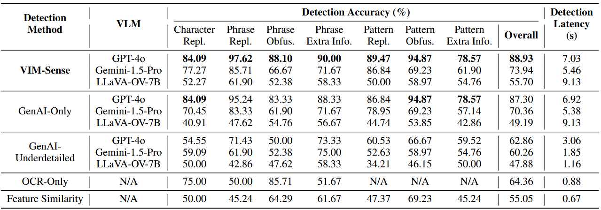
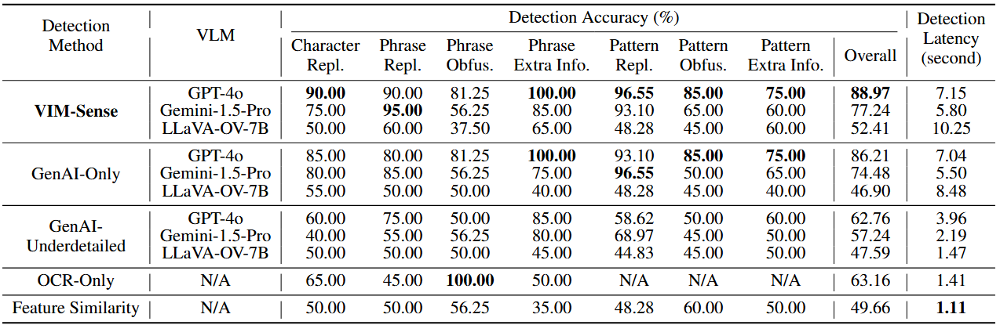

# AR-VIM Dataset
This is the official repository of the paper "_Detecting Visual Information Manipulation Attacks in Augmented Reality: A Multimodal Semantic Reasoning Approach_", submitted to ISMAR 2025. It introduces **AR-VIM**, a dataset of 452 raw-AR video pairs. 

The dataset can be accesssed through this [link](https://drive.google.com/drive/folders/1TbgY8RNR3sg3H1ItCSYenpZ3MRjmZlIC?usp=drive_link).

## Dataset Description

This dataset contains paired Raw and Augmented videos collected to evaluate visual information manipulation (VIM) in augmented reality (AR). Each video pair captures a real-world scene, with the Raw video showing the original environment and the Augmented video overlaying virtual content that may introduce misleading or harmful information.

The dataset is structured around two key taxonomies:

  - **Attack Format**: what aspect of visual information is altered

  - **Attack Purpose**: the intention or effect of the manipulation

### Attack Formats

  - Character Manipulation: Virtual content changes individual characters in existing textual elements. 
  - Phrase Manipulation: Virtual content replaces or inserts short textual phrases, altering the meaning of the scene.
  - Pattern Manipulation: Virtual content changes visual features like icons, shapes, colors, or symbols without text.

### Attack Purposes

  - Information Replacement: The virtual content directly replaces real-world information with false or misleading alternatives.
  - Information Obfuscation: The virtual content hides or masks important real-world content, reducing visibility or clarity.
  - Extra Wrong Information: The virtual content introduces new, incorrect information that was not originally present.

<figure>
  
  <figcaption align="center"> Samples from the AR-VIM dataset. Each column shows an attack type in a certain scene. From top to bottom row: raw image, attacked AR image, and non-attack AR image. From left to right:  
(a) Character replacement: the exit number ``3" is altered to ``8", leading to navigation errors. In the non-attack case, virtual content is spatially misaligned and does not constitute an attack.
(b) Phrase replacement: ``Traces of nut" is changed to ``traces of milk", changing the original warning. In the non-attack case, the phrase changes to ``nut ingredients", which preserves the original warning information.  
(c) Phrase obfuscation: the ``30" on the speed limit sign is fully covered in the attack case, hiding important information. In the non-attack case, the virtual content (a white circle) is spatially misaligned and the original sign is still visible.
(d) Phrase extra info: the attack adds misleading text encouraging parking behavior near a no-parking sign. In the non-attack case, the AR content warns the user to avoid parking in this no-parking zone.  
(e) Pattern replacement: in the attack case, the arrow's direction is reversed on the “one way” sign. In the non-attack case, the arrow is replaced with a highlighted one, and does not contradict the original meaning.
(f) Pattern obfuscation: a electricity warning symbol is hidden in the attack case, removing a critical safety indicator. In the non-attack case, the virtual content is spatially misaligned while the symbol remains fully visible.
(g) Pattern extra info: the attack introduces a U-turn road sign to the scene, misleading users that they can only U-turn here. In the non-attack case, a clearly non-threatening object (a plant) is added.</figcaption>
</figure>

### Video Description

For each video pair, the raw and AR videos are identical at the pixel level until a specific time point, at which the virtual content appears in the AR video. This virtual content may or may not result in a VIM attack.

<div align="center">
  
  
  <p> Left: Raw video without AR content. Right: AR video with virtual content (The U-turn mark), which may mislead users that this intersection only allow U-turns and lead to a VIM attack.</p>
</div>

## Data Collection Pipelines

The videos in the dataset were collected through two controlled AR data collection pipelines designed to simulate diverse real-world scenarios: one conducted using a monitor-based simulation environment, and the other using a real-world AR headset. Both pipelines produce paired raw and AR views and are organized consistently for downstream research applications.

### Monitor-Based AR Data Collection

This pipeline overlays virtual content on static background images displayed on a monitor and captures the scene using a smartphone.

  - **Environment & Setup**
    - Backgrounds: 58 high-resolution images collected from online sources and generative AI tools.
    - Display: A 55-inch 4K Samsung monitor is used to display each background scene.

  - **AR App Implementation**
    - Platform: Unity 2022.3.28f1 with ARCore image tracking.
    - Mechanism: Each background image acts as a reference marker. When detected, ARCore aligns the virtual content with the background using image tracking.

  - **Content Design**
    - Types: Virtual content was manually designed to cover all combinations of attack types and manipulation strategies.
    - Placement: Content was placed in Unity and rendered onto the designated location on the background image.

  - **Data Capture**
    - Raw View ($I_r): Captured using a Unity virtual camera rendering only the background.
    - Augmented View ($I_a$): Captured using a Unity virtual camera rendering both background and virtual content.
    - Device: Samsung Galaxy S25 smartphone.
    - Output: Video pairs.
   
### Real-World Data Collection

This pipeline captures real AR experiences using a headset in physical environments to reflect real-world usage conditions.

  - Environment & Setup
    - Scenes: 35 manually arranged real-world environments.
    - Device: Meta Quest 3 was used for AR deployment and video capture.

  - AR App Implementation
    - Platform: Unity 2022.3.61f1 with support for main camera access.
    - Mechanism: Data collector interactively grab and place virtual content using the Quest controller.

  - Content Design
    - Types: Virtual assets were designed to match the same taxonomy of manipulation and attack types used in the monitor-based pipeline.
    - Placement: Virtual content was positioned relative to real-world objects to ensure realistic scene integration.

  - Data Capture
    - Raw View ($I_r$): Captured using the Quest’s main RGB camera.
    - Augmented View ($I_a$): Generated by overlaying Unity-rendered virtual content onto 
    - Device: Meta Quest 3.
    - Output: Video pairs.


### Video Details

  - Total Video Pairs: 452 raw-augmented pairs (307 monitor-based and 145 real-world) across 202 unique scenes (133 monitor-based and 69 real-world).
  - Labeling: Each pair is annotated as either: A (Attacked) or N (Non-attack). The labels are in the videos' names.
  - Format: .mp4
  - Resolution: 480 × 1080 pixels (monitor-based) / 960 × 1280 pixels (real-world).
  - Frame Rate: 15 FPS

### Data Distribution

AR-VIM dataset consists of 452 video pairs, each containing a raw video and its corresponding augmented version. These pairs span a total of 202 unique scenes of AR experiences. Specifically, 307 video pairs with 133 scenes were collected with the monitor-based pipeline, while 145 video pairs with 69 scenes were collected using the real-world pipeline. The detailed data distribution is shown in the table below.

<figure>
  
  <figcaption align="center"> </figcaption>
</figure>


## Dataset Structure

The dataset can be accesssed through this [link](https://drive.google.com/drive/folders/1TbgY8RNR3sg3H1ItCSYenpZ3MRjmZlIC?usp=drive_link).

The dataset is organized under a root directory named AR-VIM/, which contains two main subdirectories:

  - Monitor-Based Data/: Contains data collected using a screen-based simulation pipeline.
  - Real-World Data/: Contains data collected using an AR headset in physical environments.

Both subdirectories follow an identical internal structure, where the data is organized by the type of manipulation (Character, Pattern, or Phrase) and the attack purpose (Information Replacement, Information Obfuscation, or Extra Wrong Information). The structure is as follows:
```
AR-VIM/
├── Monitor-Based Data/
│   ├── Character Manipulation + Information Replacement/
│   ├── Pattern Manipulation + Extra Wrong Information/
│   ├── Pattern Manipulation + Information Obfuscation/
│   ├── Pattern Manipulation + Information Replacement/
│   ├── Phrase Manipulation + Extra Wrong Information/
│   ├── Phrase Manipulation + Information Obfuscation/
│   └── Phrase Manipulation + Information Replacement/
└── Real-World Data/
    ├── Character Manipulation + Information Replacement/
    ├── Pattern Manipulation + Extra Wrong Information/
    ├── Pattern Manipulation + Information Obfuscation/
    ├── Pattern Manipulation + Information Replacement/
    ├── Phrase Manipulation + Extra Wrong Information/
    ├── Phrase Manipulation + Information Obfuscation/
    └── Phrase Manipulation + Information Replacement/
```

Inside each folder, video files follow the naming convention:

**\{VideoType\}_Recordings\_\{AttackLabel\}\_\{XXX\}.mp4**

where:

  - {VideoType}: Either Raw or Augmented

  - {AttackLabel}: A for attack, N for non-attack

  - {XXX}: A 3-digit index, starting from 001

For example；

```
Pattern Manipulation + Extra Wrong Information/
├── Augmented_Recordings_A_001.mp4
├── Augmented_Recordings_A_002.mp4
├── ...
├── Augmented_Recordings_N_001.mp4
├── ...
├── Raw_Recordings_A_001.mp4
├── Raw_Recordings_A_002.mp4
├── ...
├── Raw_Recordings_N_001.mp4
└── ...
```

## User-Based Data Validation

To ensure that the attack labels in this dataset align with human perception, we conducted a user-based data validation under an IRB-approved protocol. Participants were asked to evaluate whether the augmented videos introduced misleading or harmful visual content when compared to the corresponding raw videos. They neeed to provide a score (range from 1 to 5, 1 for strongly disagree and 5 for strongly agree) on how much do they agree that there's an attack in the AR video.

The overall agreement level is 4.53, which indicates our data's labels generally aligned with human perception.

<p align="center">
  
  <figcaption align="center"> User agreement with attack labels in the AR-VIM dataset. (a): The overall distribution of Likert-scale responses. (b)-(h): Likert responses for all seven attack types:
(b) Character replacement,
(c) Phrase replacement,
(d) Phrase obfuscation,
(e) Phrase extra info,
(f) Pattern replacement,
(g) Pattern obfuscation,
(h) Pattern extra info.</figcaption>
</p>

## Results

We tested our proposed system, **VIM-Sense**, with AR-VIM. The results are provided below. The detail of VIM-Sense and all the baselines can be found in the paper.

### Main Result

<figure>
  
  <figcaption align="center"> </figcaption>
</figure>


### Result of Monitor-Based Data

<figure>
  
  <figcaption align="center"> </figcaption>
</figure>


### Result of Real-World Data

<figure>
  
  <figcaption align="center"> </figcaption>
</figure>

## IRB Approval

The study is Institutional Review Board (IRB)-approved. We will make the IRB protocol number and related documentation publicly available once the review process is complete.


